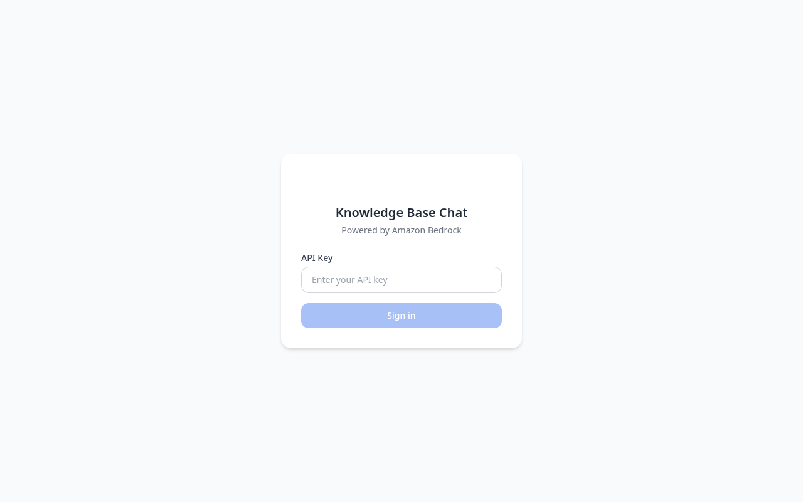
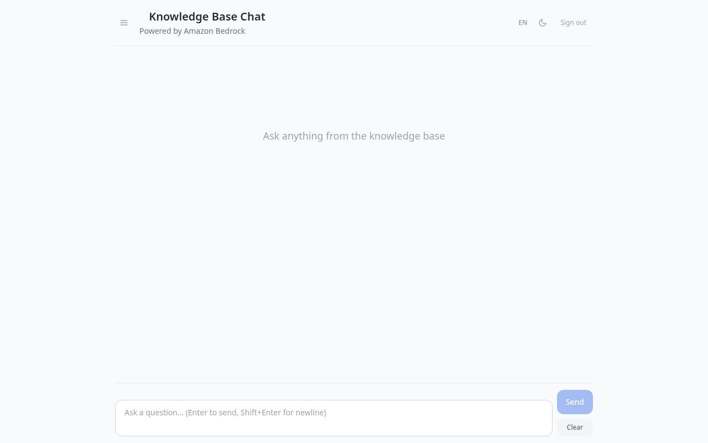

# bedrock-knowledgebases-chatbox-sample

A modern, production-ready chat UI built on [Amazon Bedrock Knowledge Base](https://docs.aws.amazon.com/bedrock/latest/userguide/knowledge-base.html).

Features streaming responses (SSE), citation display, multi-turn conversation, and a fully serverless deployment on AWS.

## Screenshots

### Login


### Chat



## Features

- 🚀 **Streaming output** — typewriter effect via Server-Sent Events (SSE)
- 📚 **Citation display** — collapsible source cards from Bedrock KB citations
- 💬 **Multi-turn conversation** — session management with DynamoDB
- 🔐 **API Key auth** — simple header-based auth, swap-in Cognito for production
- 📱 **Responsive UI** — mobile-friendly chat interface built with Tailwind CSS
- ☁️ **Serverless deployment** — CDK: CloudFront + S3 + API Gateway + Lambda

## Architecture

```
Browser
  │  SSE / REST
  ▼
Next.js API Routes
  │  AWS SDK
  ▼
Bedrock Knowledge Base  ──→  Claude (RetrieveAndGenerate)
  │
  ▼
DynamoDB (session store)
```

## Quick Start

### Prerequisites

- Node.js 20+
- AWS credentials configured (IAM role or `~/.aws/credentials`)
- An existing [Bedrock Knowledge Base](https://docs.aws.amazon.com/bedrock/latest/userguide/knowledge-base-create.html)
- Required IAM permissions:
  - `bedrock:RetrieveAndGenerate`, `bedrock:Retrieve`
  - `bedrock:GetInferenceProfile`, `bedrock:InvokeModel`
  - `dynamodb:GetItem`, `dynamodb:PutItem`, `dynamodb:CreateTable`

### Local Development

```bash
# Install dependencies
npm install

# Configure environment
cat > .env.local << 'EOF'
KNOWLEDGE_BASE_ID=your-kb-id
AWS_REGION=us-east-1
API_KEY=your-secret-key
NEXT_PUBLIC_API_KEY=your-secret-key
DYNAMODB_TABLE=bedrock-kb-chatbox-sessions
EOF

# Run dev server
npm run dev
```

Open [http://localhost:3000](http://localhost:3000).

### Environment Variables

| Variable | Where | Description |
|----------|-------|-------------|
| `KNOWLEDGE_BASE_ID` | Server | Your Bedrock Knowledge Base ID |
| `AWS_REGION` | Server | AWS region (e.g. `us-east-1`) |
| `API_KEY` | Server | Secret key checked on incoming requests |
| `NEXT_PUBLIC_API_KEY` | Client | Same value as `API_KEY` — sent in `x-api-key` header by the browser |
| `DYNAMODB_TABLE` | Server | DynamoDB table name for sessions (auto-created on first request) |

> **Note:** `API_KEY` / `NEXT_PUBLIC_API_KEY` are optional. If unset, the API accepts all requests.  
> For production, replace with Amazon Cognito or another auth layer.

### URL Parameters (Intranet Mode)

> ⚠️ **This mode is designed for intranet / internal use only.** No authentication is required when `API_KEY` is not configured. Do NOT expose to the public internet without adding a proper auth layer.

When `API_KEY` is not set, the app skips the login page and enters open-access mode. You can pass Knowledge Base and user info via URL parameters:

```
http://localhost:3000/?kb=AWS文档库&kbId=ABCDEFGH12&user=Alice&userId=550e8400-e29b
```

| Parameter | Required | Description |
|-----------|----------|-------------|
| `kbId`    | Yes      | Bedrock Knowledge Base ID, passed to the API |
| `userId`  | Yes      | User ID for session isolation |
| `kb`      | No       | Display name for the Knowledge Base (shown in header) |
| `user`    | No       | Display name for the user (shown in header) |

- `kbId` overrides the `KNOWLEDGE_BASE_ID` env var when provided.
- `kb` and `user` are display-only — they do not affect API calls.
- Different `userId` values get independent conversation histories.

### Model

This sample uses `global.anthropic.claude-sonnet-4-6` (cross-region inference profile).  
Update `modelArn` in `src/lib/bedrock.ts` to use a different model.

### Deploy to AWS

```bash
cd cdk
npm install
npx cdk deploy
```

## Project Structure

```
├── src/
│   ├── app/
│   │   ├── page.tsx               # Root page
│   │   └── api/
│   │       ├── chat/route.ts      # SSE streaming endpoint
│   │       └── session/route.ts   # Session management
│   ├── components/
│   │   ├── ChatWindow.tsx         # Main chat UI
│   │   ├── MessageBubble.tsx      # User / assistant bubbles
│   │   └── CitationCard.tsx       # Collapsible citation cards
│   └── lib/
│       ├── bedrock.ts             # Bedrock KB streaming client
│       └── session.ts             # DynamoDB session store
├── cdk/                           # CDK infrastructure (coming soon)
├── postcss.config.js
├── tailwind.config.js
└── next.config.mjs
```

## Contributing

PRs welcome. This project targets submission to [aws-samples](https://github.com/aws-samples).

## License

Apache 2.0 — see [LICENSE](LICENSE)
## OpenAI Compatible API

The server exposes an OpenAI-compatible API so you can use it with Open WebUI, AnythingLLM, or any OpenAI SDK client.

### Endpoints

| Method | Path | Description |
|--------|------|-------------|
| GET | `/v1/models` | List available models |
| POST | `/v1/chat/completions` | Chat completions (stream & non-stream) |

### Authentication

Both `x-api-key` header and `Authorization: Bearer <token>` are supported.

### Usage with OpenAI Python SDK

```python
from openai import OpenAI

client = OpenAI(
    base_url="https://your-deployment.vercel.app",  # or http://localhost:3000
    api_key="your-api-key",                          # matches API_KEY env var
)

# Non-streaming
response = client.chat.completions.create(
    model="bedrock-kb",
    messages=[{"role": "user", "content": "What is Amazon Bedrock?"}],
)
print(response.choices[0].message.content)

# Streaming
stream = client.chat.completions.create(
    model="bedrock-kb",
    messages=[{"role": "user", "content": "Explain RAG in simple terms"}],
    stream=True,
)
for chunk in stream:
    print(chunk.choices[0].delta.content or "", end="", flush=True)
```

### Multi-turn Conversations

Pass `bedrock_session_id` from a previous response back as `session_id` in the request body to maintain conversation context:

```python
import httpx, json

resp = httpx.post(
    "https://your-deployment.vercel.app/v1/chat/completions",
    headers={"Authorization": "Bearer your-api-key"},
    json={"model": "bedrock-kb", "messages": [{"role": "user", "content": "Hello"}]},
)
data = resp.json()
session_id = data.get("bedrock_session_id")

# Continue the conversation
resp2 = httpx.post(
    "https://your-deployment.vercel.app/v1/chat/completions",
    headers={"Authorization": "Bearer your-api-key"},
    json={
        "model": "bedrock-kb",
        "messages": [{"role": "user", "content": "Tell me more"}],
        "session_id": session_id,
    },
)
```

### Open WebUI / AnythingLLM

Set the **OpenAI API base URL** to your deployment URL and use `bedrock-kb` as the model name.

## Two-Step RAG (Retrieve + OpenAI Generate)

By default the app uses Bedrock's `RetrieveAndGenerate` API (single call). You can switch to a two-step pipeline where Bedrock only handles retrieval and a separate OpenAI-compatible model does generation:

```env
# Optional — enable two-step RAG
OPENAI_BASE_URL=https://api.openai.com    # or any OpenAI-compatible endpoint
OPENAI_API_KEY=sk-...
OPENAI_MODEL=gpt-4o-mini                  # default: gpt-4o-mini
```

When these variables are set:
1. **Retrieve** — `POST /retrieve` to Bedrock KB → get top-N document chunks
2. **Generate** — call your configured OpenAI endpoint with the chunks as context

When not set, the original `RetrieveAndGenerate` flow is used as fallback.
